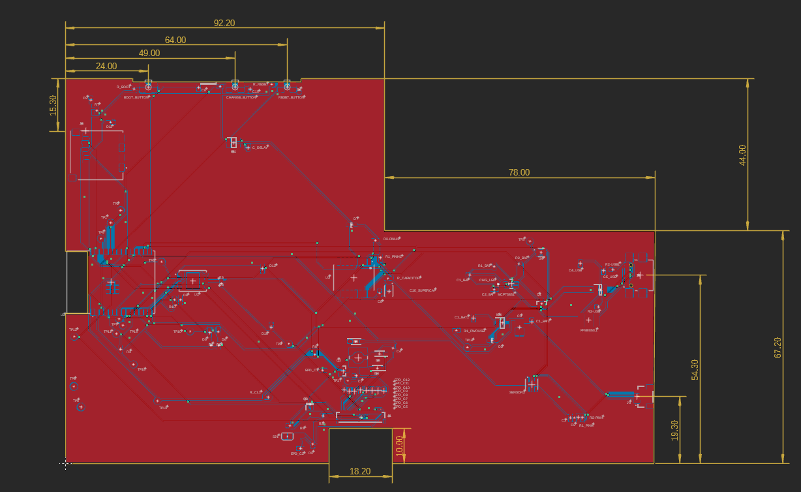

# OpenBook - E-book Reader

## Descriere generala

OpenBook este un dispozitiv de citit carti electronice (e-book reader) conceput pentru a fi ieftin si open-source.

## Diagrama bloc

## BOM (Bill Of Materials)

## Bill Of Materials (BOM)
| Componenta                 | Link                                                                                                                                                                | Datasheet                                               |
|-----------------------------|-----------------------------------------------------------------------------------------------------------------------------------------------------------------------------|---------------------------------------------------------|
| BD5229G-TR                  | [Mouser](https://ro.mouser.com/ProductDetail/ROHM-Semiconductor/BD5229G-TR?qs=4kLU8WoGk0vvnhrrYwdszw%3D%3D)                                                                 | [Datasheet](https://fscdn.rohm.com/en/products/databook/datasheet/ic/power/voltage_detector/bd52xxg-e.pdf)|
| BME688                      | [Mouser](https://ro.mouser.com/ProductDetail/Bosch-Sensortec/BME688?qs=IS%252B4QmGtzzqQoVDscqwx3A%3D%3D)                                                           | [Datasheet](https://ro.mouser.com/datasheet/2/783/bst_bme688_fl000-2307034.pdf)|
| Bobina                      | [Mouser](https://ro.mouser.com/ProductDetail/Wurth-Elektronik/744043680?qs=PGXP4M47uW6VkZq%252BkzjrHA%3D%3D)                                                                | [Datasheet](https://www.we-online.com/components/products/datasheet/744043680.pdf)|
| Button                      | [Mouser](https://ro.mouser.com/ProductDetail/CK/KMR221GULCLFS?qs=u2NJ%252B70r0goBXaNk7IrU0Q%3D%3D)                                                                          |[Datasheet](https://www.ckswitches.com/media/1479/kmr2.pdf)|
| Capacitor 0.1uF / 50V       | [Farnell](https://ro.farnell.com/multicomp-pro/mcmlr50v104kx7r/ceramic-capacitor-0-1uf-50v-x7r/dp/1600875?srsltid=AfmBOop-NuqSwaWYAsNDvdMnjraBeqfj0sl8f99iLZ_KJc8xpnT4fSqT) | [Datasheet](https://www.farnell.com/datasheets/2873577.pdf?_gl=1*x28a2*_gcl_au*MTYwODAzNzc2OC4xNzQzNDM1MjM4)|
| Capacitor 1uF               | [Mouser](https://ro.mouser.com/ProductDetail/KEMET/C0402C105K9PACTU?qs=UdQET6xYxVCMExqTDkuPeQ%3D%3D)                                                                        | [Datasheet](https://ro.mouser.com/datasheet/2/447/KEM_C1006_X5R_SMD-3316465.pdf)|
| Capacitor 1uF / 50V         | [Mouser](https://ro.mouser.com/ProductDetail/TDK/C1608X7R1H105K080AB?qs=sGAEpiMZZMsh%252B1woXyUXjwVqLNpRsvnQGmKhuYn4DWE%3D)                                                 | [Datasheet](https://product.tdk.com/system/files/dam/doc/product/capacitor/ceramic/mlcc/catalog/mlcc_commercial_general_en.pdf)|
| Capacitor 4.7uF             | [Mouser](https://ro.mouser.com/ProductDetail/KEMET/C0402C475M9PAC7411?qs=cpo3%2FpBou2jRzZxyxJnMGg%3D%3D)                                                                    | [Datasheet](https://ro.mouser.com/datasheet/2/447/KEM_C1006_X5R_SMD-3316465.pdf)|
| Capacitor 4.7uF / 25V       | [Mouser](https://ro.mouser.com/ProductDetail/KYOCERA-AVX/12063C475KAZ2A?qs=%252BdQmOuGyFcG3LdbVp5waMw%3D%3D)                                                                | [Datasheet](https://ro.mouser.com/datasheet/2/40/X7RDielectric-2943470.pdf)|
| Capacitor 10uF              | [Mouser](https://ro.mouser.com/ProductDetail/KEMET/C0402C106M9PACTU?qs=x4XeXhDQKnp%252Bz0lMlwMC3A%3D%3D)                                                                    | [Datasheet](https://ro.mouser.com/datasheet/2/447/KEM_C1006_X5R_SMD-3316465.pdf)|
| Capacitor 100nF             | [Mouser](https://ro.mouser.com/ProductDetail/KEMET/C0402C104K4RAL?qs=pIZUS6sqCWCaMuP2QVR%2Fog%3D%3D)                                                                        | [Datasheet](https://ro.mouser.com/datasheet/2/447/KEM_C1018_X7R_SnPb_SMD-3316276.pdf)|
| Capacitor 100uF TANT        | [Mouser](https://ro.mouser.com/ProductDetail/KYOCERA-AVX/TAJW107M010RNJ?qs=Wtp%252Bf%2FAeVqIH8v1VxV%252B1Rg%3D%3D)                                                          | [Datasheet](https://ro.mouser.com/datasheet/2/40/TAJ-3165264.pdf)|
| Capacitor SUPERCAP          | [Mouser](https://ro.mouser.com/ProductDetail/Seiko-Semiconductors/CPH3225A?qs=3etwrb1wR%252BhUOph6lAO7eg%3D%3D)                                                             | [Datasheet](https://ro.mouser.com/datasheet/2/360/Seiko_Instruments_MicroBattery_E_20230330_2024Jan_-3561061.pdf)|
| CHG_LED                     | [CPC](https://cpc.farnell.com/kingbright/kpg-1608zgc/led-smd-0603-grn/dp/SC20796)                                                                                           | [Datasheet](https://www.farnell.com/datasheets/2046349.pdf)|
| DMG2305UX-7                 | [Mouser](https://ro.mouser.com/ProductDetail/Diodes-Incorporated/DMG2305UX-7?qs=L1DZKBg7t5F%2FNBHrjfxC%252Bg%3D%3D)                                                         | [Datasheet](https://www.diodes.com/assets/Datasheets/DMG2305UX.pdf)|
| DS3231SN#                   | [Mouser](https://ro.mouser.com/ProductDetail/Analog-Devices-Maxim-Integrated/DS3231SN?qs=1eQvB6Dk1vhUlr8%2FOrV0Fw%3D%3D)                                                    | [Datasheet](https://ro.mouser.com/datasheet/2/609/DS3231-3421123.pdf)|
| ESP32-C6-WROOM-1-N8         | [Mouser](https://ro.mouser.com/ProductDetail/Espressif-Systems/ESP32-C6-WROOM-1-N8?qs=8Wlm6%252BaMh8ST02Gmwp74cw%3D%3D)                                                    | [Datasheet](https://ro.mouser.com/datasheet/2/891/Espressif_ESP32_C6_WROOM_1__Datasheet_V0_1_PRELIMI-3239987.pdf)|
| FH34SRJ-24S-0.5SH_99_       | [Mouser](https://ro.mouser.com/ProductDetail/Hirose-Connector/FH34SRJ-24S-0.5SH99?qs=vcbW%252B4%252BSTIpKBl5ap9J8Fw%3D%3D)                                                  | [Datasheet](https://ro.mouser.com/datasheet/2/185/FH34SRJ_24S_0_5SH_99__CL0580_1255_6_99_2DDrawing_0-1615044.pdf)|
| 112A-TAAR-R03_ATTEND        | [LCSC](https://www.lcsc.com/product-detail/SD-Card-Connectors_Attend-Technology-112A-TAAR-R03_C6970445.html)                                                                | [Datasheet](https://www.lcsc.com/datasheet/lcsc_datasheet_2411220717_Attend-Technology-112A-TAAR-R03_C6970445.pdf)|
| MAX17048G+T10               | [Mouser](https://ro.mouser.com/ProductDetail/Analog-Devices-Maxim-Integrated/MAX17048G%2bT10?qs=D7PJwyCwLAoGnnn8jEPRBQ%3D%3D)                                               | [Datasheet](https://ro.mouser.com/datasheet/2/609/MAX17048_MAX17049-3469099.pdf)|
| MBR0530                     | [Mouser](https://ro.mouser.com/ProductDetail/onsemi/MBR0530T3G?qs=3JMERSakebpEmdUS6GetdQ%3D%3D)                                                                             | [Datasheet](https://www.onsemi.com/products/discrete-power-modules/schottky-diodes-schottky-rectifiers/mbr0530t3g)|
| MCP73831                    | [Mouser](https://ro.mouser.com/ProductDetail/Microchip-Technology/MCP73831-2ACI-MC?qs=hH%252BOa0VZEiBneYTVdpuVdg%3D%3D)                                                     | [Datasheet](https://ro.mouser.com/datasheet/2/268/MCP73831_Family_Data_Sheet_DS20001984H-3441711.pdf)|
| PFMF.050.1                  | [Mouser](https://ro.mouser.com/ProductDetail/Schurter/PFMF.050.2?qs=1auRipcfynCums5v1iucSA%3D%3D)                                                                           | [Datasheet](https://ro.mouser.com/datasheet/2/358/typ_PFMF-1275918.pdf)|
| PGB1010603MR                | [Mouser](https://ro.mouser.com/ProductDetail/Littelfuse/PGB1010603MR?qs=gu7KAQ731URLg4GSnNNN7Q%3D%3D)                                                                       | [Datasheet](https://www.littelfuse.com/assetdocs/pulseguard-esd-suppressors-pgb1-datasheet?assetguid=8a337998-d54d-466b-be4e-dc5bcd1f9321)|
| QWIIC_RIGHT_ANGLEA          | [Mouser](https://ro.mouser.com/ProductDetail/JST-Commercial/SM04B-SRSS-TBLFSN?qs=cdbOS8ANM9B3FdyA6cNU2A%3D%3D)                                                              | [Datasheet](https://ro.mouser.com/datasheet/2/564/eSR_SZ-3476820.pdf)|
| Resistor 0.47               | [Mouser](https://ro.mouser.com/ProductDetail/Vishay-Beyschlag/MCT06030C4700FP500?qs=XsZ9OvPb0dt82KlzjdcMjQ%3D%3D)                                                           | [Datasheet](https://www.vishay.com/docs/28705/mcx0x0xpro.pdf)|
| Resistor 2k                 | [Venkel](https://www.venkel.com/part/CR0402-16W-2002FT)                                                                                                                     | [Datasheet](https://data.venkel.com/documents/cr-series?_gl=1*1sqolfs*_ga*MTAzMTIxOTYyMS4xNzQzNzU5MjAy*_ga_JRKGBZNVM8*MTc0Mzc1OTIwMS4xLjEuMTc0Mzc1OTY2OS4zNC4wLjA.)|
| Resistor 5k1                | [Venkel](https://venkel.com/part/CR0402-10W-5101FT)                                                                                                                         | [Datasheet](https://data.venkel.com/documents/cr-series?_gl=1*1e041jc*_ga*MTAzMTIxOTYyMS4xNzQzNzU5MjAy*_ga_JRKGBZNVM8*MTc0Mzc1OTIwMS4xLjEuMTc0Mzc1OTU2Ny41MS4wLjA.)|
| Resistor 10K                | [DigiKey](https://www.digikey.com/en/products/detail/venkel/CR0402-10W-102JT/12332774)                                                                                      | [Datasheet](https://data.venkel.com/documents/cr-series?_gl=1*mn27ew*_ga*MTAzMTIxOTYyMS4xNzQzNzU5MjAy*_ga_JRKGBZNVM8*MTc0Mzc1OTIwMS4xLjAuMTc0Mzc1OTIwMi41OS4wLjA.)|
| Resistor 100K               | [Venkel](https://venkel.com/part/CR0402-16W-1003FT)                                                                                                                         | [Datasheet](https://data.venkel.com/documents/cr-series?_gl=1*oleae1*_ga*MTAzMTIxOTYyMS4xNzQzNzU5MjAy*_ga_JRKGBZNVM8*MTc0Mzc1OTIwMS4xLjEuMTc0Mzc1OTM0My4zNi4wLjA.)|
| SAMACSYS_PARTS_USB4110-GF-A | [Mouser](https://ro.mouser.com/ProductDetail/GCT/USB4110-GF-A?qs=KUoIvG%2F9IlYiZvIXQjyJeA%3D%3D)                                                            | [Datasheet](https://ro.mouser.com/datasheet/2/837/GCT_USB4110_Product_Drawing___20k_cycles-3455479.pdf)|
| SD0805S020S1R0              | [Mouser](https://ro.mouser.com/ProductDetail/KYOCERA-AVX/SD0805S020S1R0?qs=jCA%252BPfw4LHbpkAoSnwrdjw%3D%3D)                                                                | [Datasheet](https://ro.mouser.com/datasheet/2/40/schottky-3165252.pdf)|
| SI1308EDL-T1-GE3            | [Mouser](https://ro.mouser.com/ProductDetail/Vishay-Semiconductors/SI1308EDL-T1-GE3?qs=bX1%252BNvsK%2FBramh9tgpOaEw%3D%3D)                                                  | [Datasheet](https://www.vishay.com/docs/63399/si1308edl.pdf)|
| USBLC6-2SC6Y                | [Mouser](https://ro.mouser.com/ProductDetail/STMicroelectronics/USBLC6-2SC6Y?qs=gNDSiZmRJS%2FOgDexvXkdow%3D%3D)                                                             | [Datasheet](https://ro.mouser.com/datasheet/2/389/usblc6_2sc6y-1852505.pdf)|
| W25Q512JVEIQ                | [Mouser](https://ro.mouser.com/ProductDetail/Winbond/W25Q512JVEIQ?qs=l7cgNqFNU1jw6svr3at6tA%3D%3D)                                                           | [Datasheet](https://ro.mouser.com/datasheet/2/949/Winbond_W25Q512JV_Datasheet-3240039.pdf)|
| XC6220A331MR-G              | [Mouser](https://ro.mouser.com/ProductDetail/Torex-Semiconductor/XC6220A331MR-G?qs=AsjdqWjXhJ8ZSWznL1J0gg%3D%3D)                                                            | [Datasheet](https://ro.mouser.com/datasheet/2/760/xc6220-3371556.pdf)|

## Descrierea functionalitatii hardware

### Sistem de alimentare si gestionare a energiei

Dispozitivul OpenBook implementeaza un sistem dual de alimentare, functionand atat prin conectorul USB-C cat si prin bateria reincarcabila Li-Po. Modulul MCP73831 gestioneaza procesul de incarcare inteligenta a bateriei, asigurand protectie la supraincarcare si optimizarea ciclurilor de incarcare. Convertorul LDO XC6220A331MR-G stabilizeaza tensiunea la 3.3V pentru toate componentele electronice, asigurand functionarea eficienta a sistemului.

Pentru alimentarea afisajului e-paper, care necesita tensiuni specifice, am proiectat un circuit dedicat bazat pe bobina inductiva 744043680 si diode Schottky pentru generarea si stabilizarea tensiunilor necesare functionarii optime a ecranului.

### Unitatea centrala de procesare

La baza sistemului se afla modulul ESP32-C6-WROOM-1-N8, care integreaza microcontrolerul ESP32-C6 impreuna cu conectivitate wireless WiFi si Bluetooth. Acesta coordoneaza toate operatiunile dispozitivului, de la gestionarea interfetei cu utilizatorul pana la procesarea si afisarea textului. Designul include butoane dedicate pentru reset si boot, facilitand atat utilizarea normala cat si procesele de dezvoltare si depanare.

### Sisteme de conectivitate si interfete

- **Portul USB-C**: Asigura atat alimentarea si incarcarea bateriei cat si transferul de date pentru gestionarea bibliotecii digitale
- **Slotul microSD**: Permite extinderea capacitatii de stocare pentru biblioteci extinse de carti electronice
- **Conectorul FPC cu 24 pini**: Interfata specializata pentru afisajul e-paper de 7.5 inch
- **Conectorul Qwiic/Stemma QT**: Faciliteaza integrarea modulara a senzorilor si perifericelor I2C aditionale

### Subsisteme de stocare si functii auxiliare

- **Memoria flash W25Q512JVEIQ**: Ofera 64MB de spatiu de stocare persistent pentru sistemul de operare si datele utilizatorului
- **Modulul RTC DS3231**: Mentine cronometrarea precisa a timpului real, chiar si cand dispozitivul este oprit, datorita sistemului de backup cu supercapacitor
- **Senzorul ambiental BME688**: Monitorizeaza conditiile de mediu (temperatura, umiditate, presiune atmosferica si calitatea aerului) pentru ajustarea optima a parametrilor de afisare
- **Circuitul integrat MAX17048**: Monitorizeaza cu precizie starea bateriei si ofera utilizatorului informatii despre autonomia ramasa

## Design Log
- Am modificat pozitionarea butoanelor din carcasa pentru a se potrivi cu cele de pe PCB.
- Am aprobat 2 erori DRC de dimenisiune pentru USB, conform enuntului.

## Descrierea pinilor ESP32-C6 utilizati

| Pin ESP32-C6 | Functie | Descriere |
|--------------|---------|-----------|
| IO0 | INT_RTC | Semnal de intrerupere de la RTC |
| IO1 | 32KHZ | Semnal de ceas de la RTC |
| IO2 | MISO | Comunicatie SPI cu cardul SD|
| IO3 | EPD_BUSY | Semnal ocupat de la e-paper |
| IO4, IO5 | SS_SD, EPD_DC | Selectie card SD si control date/comanda e-paper |
| IO6, IO7 | SCK, MOSI | Clock SPI si date de iesire |
| IO8 | GPIO8 | Pin de uz general |
| IO9 | IO/BOOT | Buton de boot |
| IO10, IO11 | EPD_CS, FLASH_CS | Selectie chip pentru display si memoria flash |
| IO12, IO13 | USB_D-, USB_D+ | Comunicatii USB |
| IO15 | IO/CHANGE | Buton de schimbare pagina |
| IO16 | TX | Transmitere seriala (UART) |
| IO17 | RX | Receptie seriala (UART) |
| IO18 | RTC_RST | Reset pentru RTC |
| IO19 | I2C_PW | Control alimentare pentru perifericele I2C |
| IO20 | EPD_3V3_C | Control alimentare pentru display |
| IO21, IO22 | SDA, SCL | Comunicatii I2C |
| IO23 | EPD_RST | Reset pentru display |
| EN | RESET | Semnal de reset pentru ESP32 |

## Imagini:

